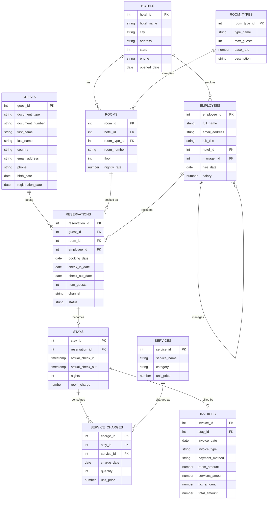

# HOTEL - Oracle Practice Schema

HOTEL is a sample Oracle schema for practicing SQL and database administration: joins, aggregations, date arithmetic, `GROUPING SETS`, hierarchical queries (`CONNECT BY`), cross-schema grants, constraints and index design. It models a small Peruvian hotel chain, using plain relational SQL.

It follows the same install/create/populate/uninstall pattern as [SHOPCO](https://github.com/rdrgcastilla/oracle-samples-shopco) and Oracle's own sample schemas (`HR`, `OE`, `customer_orders`, etc.).

## About HOTEL

Hotel Inti is a fictional chain with five hotels in Lima (Miraflores), Cusco, Arequipa, Paracas and Trujillo. Each hotel has twelve rooms of five types, from simple rooms to a presidential suite, with nightly rates that vary by city. The chain is run by a director of operations; each hotel has a general manager, a front-desk team, a housekeeping supervisor and an executive chef.

Guests - Peruvian and foreign - book rooms through the web, by phone or through travel agencies. A booking can end up checked out, cancelled, as a no-show, or still confirmed for a future date. Every checked-out booking has a stay record with the actual check-in and check-out times, the extra services consumed (restaurant, bar, spa, laundry, transfers, tours) and a final invoice (boleta or factura) with 18% IGV.

All names, documents, companies and figures are fictional. Text is stored without accents to avoid client character-set issues in SQL*Plus.

## Entity-relationship diagram



## Files

| File | Purpose |
|---|---|
| `hotel_install.sql` | Main entry point. Creates the `HOTEL` user, grants privileges, and calls the two scripts below. |
| `hotel_create.sql` | Creates the 10 tables, constraints, indexes, views and comments. |
| `hotel_populate.sql` | Loads the sample data. |
| `hotel_uninstall.sql` | Drops the schema (`DROP USER hotel CASCADE`). |

## Requirements

- Oracle Database 19c or later.
- A user with privileges to create/drop another user (e.g. `SYSTEM`, or `SYS AS SYSDBA`), connected to the target PDB.

## Installation

Run `hotel_install.sql` while connected as a privileged user. It calls `hotel_create.sql` and `hotel_populate.sql` automatically, so all four `.sql` files should be in the same directory. You'll be prompted for:

1. a password for the new `HOTEL` user (avoid `@`, `/` and spaces);
2. the tablespace for `HOTEL` (press Enter to accept the database default);
3. the temporary tablespace for `HOTEL` (press Enter to accept the database default);
4. the connect identifier used to reconnect as `HOTEL` at the end (e.g. `//localhost:1521/pdb_ab`).

Once installation finishes, your session is reconnected as `HOTEL`, ready to query. A successful install leaves you with these row counts:

```
hotels              5
room_types          5
rooms              60
guests             80
employees          31
reservations      300
stays             210
services           12
service_charges   323
invoices          210
```

## Schema overview

- **hotels** - the five hotels of the chain and their city
- **room_types** - room categories, capacity and reference rate
- **rooms** - twelve rooms per hotel, with their nightly rate in soles
- **guests** - Peruvian (DNI) and foreign (passport / CE) guests
- **employees** - staff, including a reporting hierarchy (`manager_id`, self-referencing)
- **reservations** - bookings with dates, number of guests, channel (`WEB`, `PHONE`, `AGENCY`) and status
- **stays** - actual check-in / check-out for checked-out reservations
- **services** - extra services (food, bar, spa, laundry, transport, tours)
- **service_charges** - services consumed during each stay
- **invoices** - final invoice per stay, with room, services, IGV and total amounts

Included views: `hotel_revenue_summary` (using `GROUPING SETS`), `service_sales_summary` (sales per service), `employee_hierarchy` (using `CONNECT BY`).

Indexes are created on foreign-key columns. `guests.last_name` and `reservations.channel` are intentionally left unindexed for index-design exercises.

## Uninstalling

Run `hotel_uninstall.sql` as a privileged user to remove the schema entirely.
